# Harmony-hub
Harmony-Hub: A feel-good wellness application!
https://imooon.github.io/Harmony-Hub-App/

## Table of Contents 

- Description
- Usage
- Credits
- License

# Description

- As a user interested in wellness and feeling good I want to be able to go on a website and access a variety of different resources. Acceptance Criteria: Find various tools all on one webpage to interact with to feel good and aid in wellness.

- The motivation for this project was to create a website where users can access a variety of tools to aid in feeling good and support their wellness. 

- On this website a user can access sounds, videos, reading articles, see randomly generated positive messages, partake in an informational quiz and post a positive message to the positivity board. The idea was to create a space users could visit to access a variety of tools all on one webpage, ie. music, videos, reading articles, etc. rather than websites which only provide one tool, ie. music. 

- What sets this website apart from others is having all these tools accessiable to the user in one space rather than having to visit multiple websites, while also solving this problem. We also have unique tools which are not available on other websites, ie. the positivity board.

- The target audience for this website is anyone interested in promoting wellness, positivity and happiness in their life. 

- To create this website HTML, CSS, JavaScript, Google Fonts and APIS were utilized. More, specifically, Spotify and Advice Slip API's were used. 

- A number of challenges were faced while making this project. Managing the GitHub repository while following best practices was one of the initial issues faced and continued throughout the project. Creating branches, merging branches and completing pull requests caused some errors. 

- Challenges arose for all members when trying to implement the YouTube API and all members were unsuccessful. 

- Challenges were faced when implementing JavaScript in order to obtain user interactivity. Implementing functions was at times difficult and a group effort. 

- Challenges were also faced when implementing media queries to accomodate various screen sizes, especially smaller screens, ie. tablets and phones. 

- Upon implementing the Spotify API we realized that only 29 second clips were available. For future development we would like to improve upon this API functionality so that the user is able to access complete songs.

- We would also like to implement the YouTube API in the future so that when users visit the video page they can search videos through the API rather than just seeing video thumbnails.

- In the future, we would also like to implement an API that provides the user access to search reading articles on the information page. 

- In the making of this project group members learned a number of things. We gained a better understanding of repository maintenance, for example, working off of different branches, merging conflicts and resolving them. It also gave the members exposure to work environments where these processes are expected. 

- Group members also improved their coding skills while learning from each other and see other coding styles. 

# Usage

- To use this website all that is needed is a browser and an internet connection. Once the URL is placed in the brower the website will open.

- No authentications are needed to access the website.

- Once on the website users will be brought to the home page where they will see random quotes being generated every 10 seconds. They can then click the explore button to be brought to the main page.

- Once on the main page users have a choice of which page they would like to choose next. 

- On the quiz page the user can opt to answer self-assessment questions and reflect on their mood and day, or not, and then they will be brought to a page which uses an API to randomly generate quotes. At the end of the quiz the user will also be given the option to search for any type of advice. 

- The sounds page offers a drop down menu where the user can select a sound from nine choices. They will then be given seven options to choose from which are 29 seconds in length. 

- On the videos pages users will see seven videos which offer sounds and visually appealing images and/or information on specific topics. 

- On the information page the user will see links they can click to reading articles on an outside website. Here they can read and learn about various topics in much more depth.  

- On the positivity board the user can leave a message for others to see which then gets posted to the page. 

- On the about us and Contact page the user will see blurbs about each developer and their contact information.

## URL of the GitHub repository

https://github.com/imooon/Harmony-Hub-App)

## URL of the deployed application

https://imooon.github.io/Harmony-Hub-App/)

- 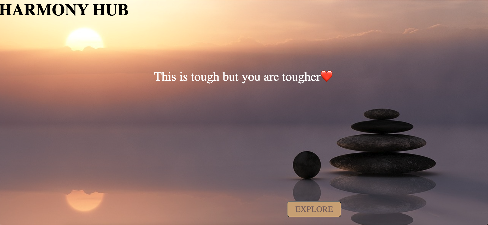

- 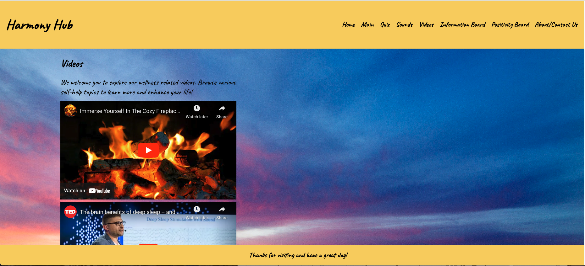

- 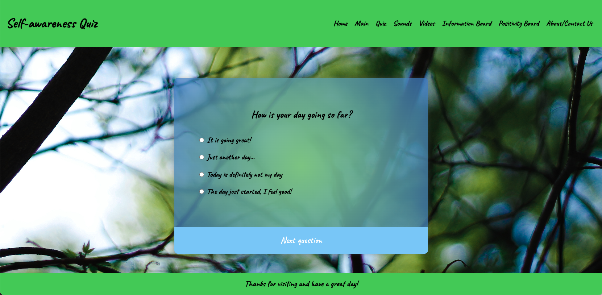

- 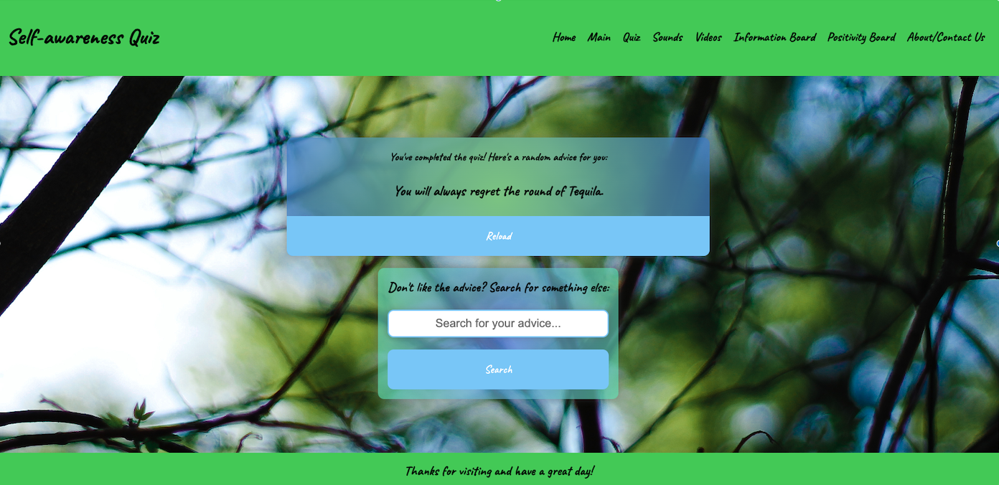

- 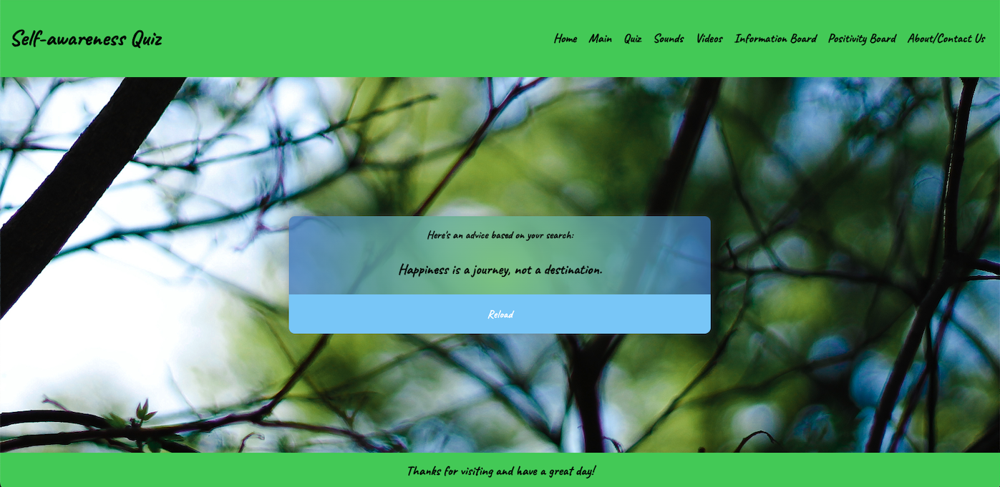

- 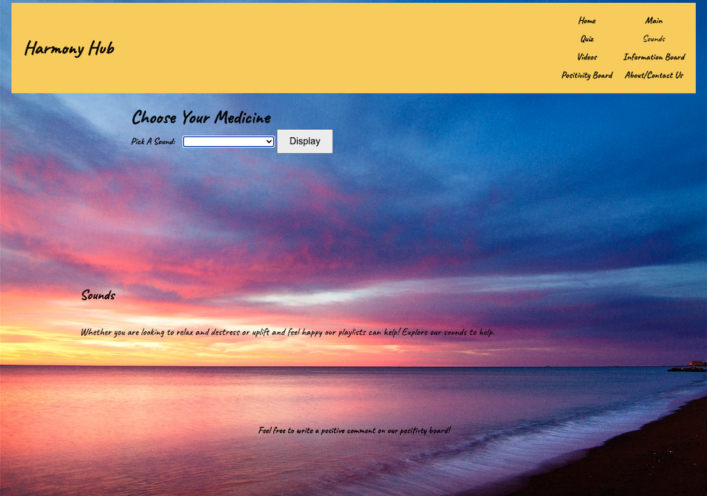

- 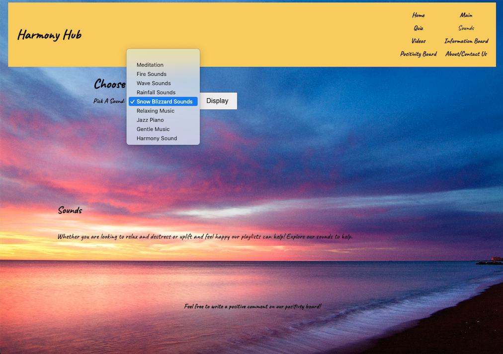

- 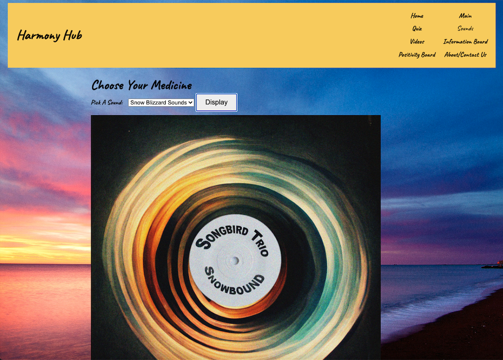

- 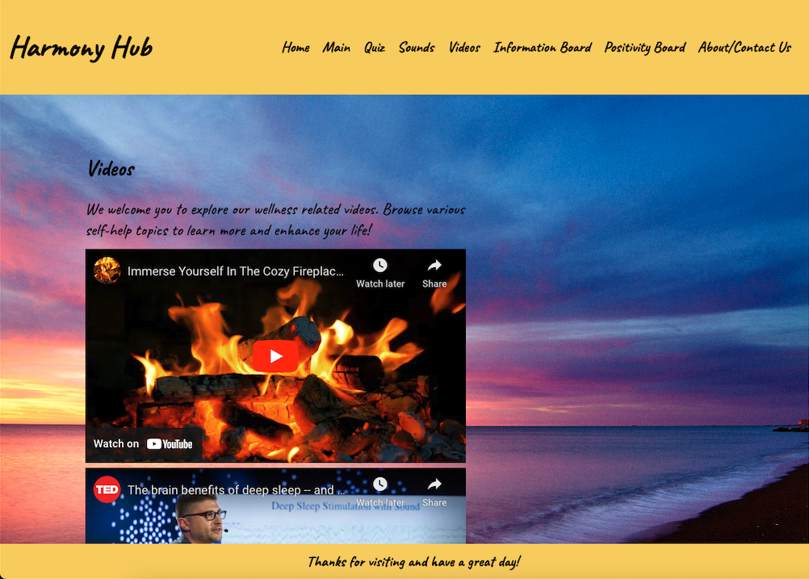

- 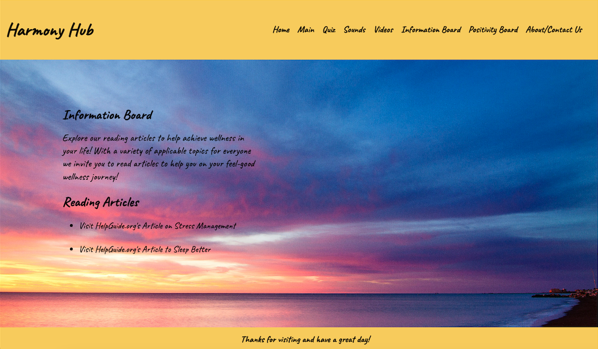

- 

- 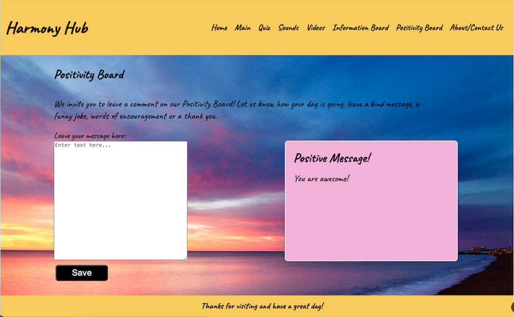

- 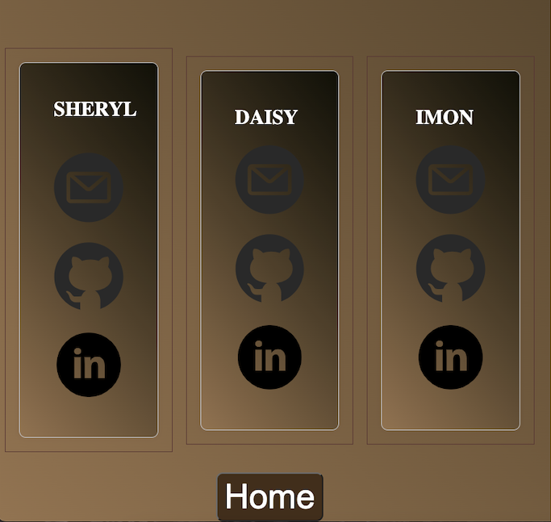

# Credits

Al, Q. (2017). Body of Water and Seashore [Photograph]. Unsplash. https://unsplash.com/photos/body-of-water-and-seashore-JFeOy62yjXk

Create a Mobile Toggle Navigation Menu Using HTML, CSS and JavaScript. (2023, May 22). Geeks for Geeks. Retrieved February 20, 2024, from https://www.geeksforgeeks.org/create-a-mobile-toggle-navigation-menu-using-html-css-and-javascript/?ref=header_search

Fitzgerald, A. (2022, June 17). How to Make an HTML Text Box [Examples]. Hubspot. https://blog.hubspot.com/website/html-text-box

Free Code Camp. (2019, May 11). Code your own YouTube app: YouTube API + HTML + CSS + JavaScript (full tutorial) [Video]. YouTube. https://www.youtube.com/watch?v=9sWEecNUW-o

Nyakundi, H. (2021, December 8). How to Write a Good Readme File for Your GitHub Project. FreeCodeCamp. https://www.freecodecamp.org/news/how-to-write-a-good-readme-file/

Request-Response: The Full-Stack Blog. (2023, November, 14). Professional Readme Guide. Retrieved January 7, 2024

Robinson, L. & Smith, M. (2023, November 8). How to Fall Asleep Fast and Sleep Better. HelpGuide.org. https://www.helpguide.org/articles/sleep/getting-better-sleep.htm

Robinson, L. & Smith, M. (2024, January 9). Stress Management: How to Reduce and Relieve Stress. HelpGuide.org. https://www.helpguide.org/articles/stress/stress-management.htm

Spotify. (n.d.). Spotify API. https://developer.spotify.com/

University of Toronto. (2023). Coding Boot Camp [Source Code].

W3Schools. (n.d.). HTML Background Images. https://www.w3schools.com/html/html_images_background.asp

Coding with Nick. (2021, September, 6). Create a Quiz App using HTML, CSS, JavaScript. https://codingwithnick.in/create-a-quiz-app-using-html-css-javascript/

Bro Code. (2023, December 28). How to FETCH data from an API using JavaScript [Video]. YouTube. https://www.youtube.com/watch?v=CqddbIrEM5I

CSS Gradient. (n.d.). Ultimate CSS Gradient Generator. https://cssgradient.io/

Nidharia, Imon. (2015). Background image for Quiz.

Advice Slip. (n.d.). Advice Slip API. https://api.adviceslip.com/#top

Oston Code Cypher. (2021, May 29). Display Random Advice On Your  Website or  Web App Using Advice Slip JSON API. YouTube. https://youtu.be/2AfzKmgqWUE?feature=shared

## Licence 

- MIT License

- Please refer to the MIT License in the repository for detailed information.
